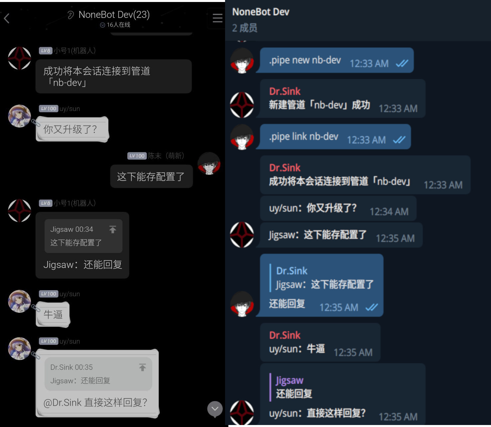

# Nonebot Plugin Pipe

基于 [NoneBot2](https://github.com/nonebot/nonebot2) 的 OneBot V12 会话转接插件

[](LICENSE)


[](https://pypi.python.org/pypi/nonebot-plugin-pipe)



## 为什么你需要会话转接

首先，规避专有软件对你隐私权的侵犯，这也是本人开发本插件的初衷。

再者，本插件可以令你远离糟糕的聊天软件。众所周知，QQ 客户端（无论 PC、Android）极其臃肿，如果有人在一个活跃的群回复了一条许久之前的消息，你的客户端多半是不能跳转到被回复的消息，而 Telegram 在这方面较为流畅，那么使用会话转接将消息转发到 Telegram 就是个十分不错的选择。

当然，本插件不只能在 QQ 和 Telegram 间转发消息，只要该平台有对应的 [OneBot 实现](https://onebot.dev/ecosystem.html#onebot-%E5%AE%9E%E7%8E%B0)，本插件就能够在其中转接会话。

## 安装

### 从 PyPI 安装（推荐）

- 使用 nb-cli  

```sh
nb plugin install nonebot-plugin-pipe
```

- 使用 pdm

```sh
pdm add nonebot-plugin-pipe
```

- 使用 pip

```sh
pip install nonebot-plugin-pipe
```

### 从 GitHub 安装（不推荐）

```sh
pdm add git+https://github.com/nonepkg/nonebot-plugin-pipe
```
